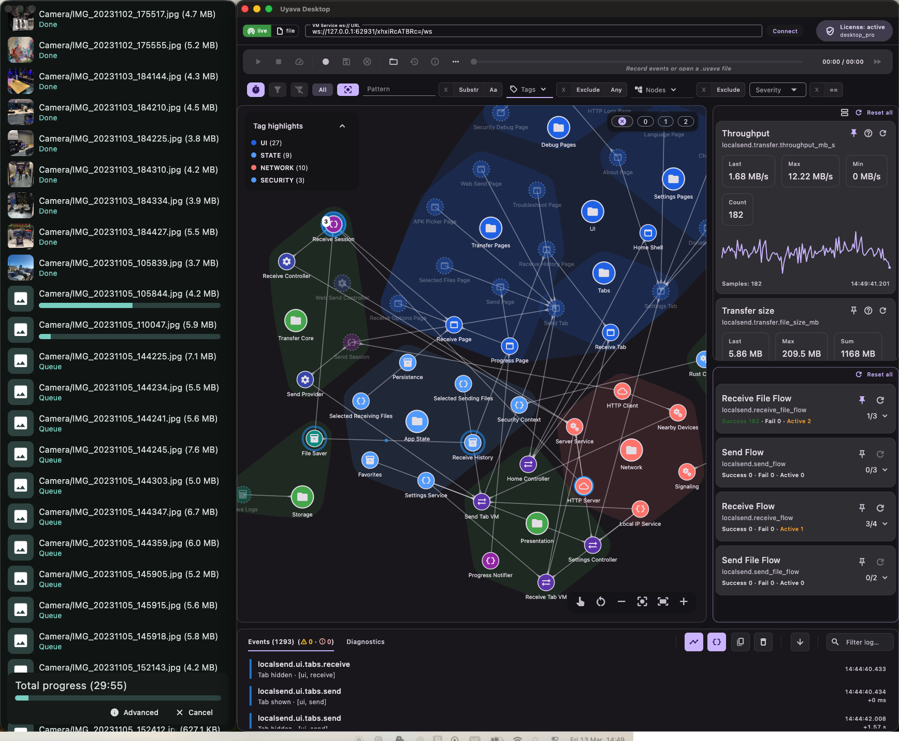

# Uyava Showcase In LocalSend

This document describes the Uyava-specific surface added by this fork of [LocalSend](https://github.com/localsend/localsend).

## Scope

Uyava is used here for three complementary views of the app:

- static architecture visibility,
- runtime lifecycle and event visibility,
- and transfer-oriented debugging data.

The intent is not to mirror every implementation detail. The graph should stay useful for debugging and architecture comprehension without collapsing into noise.

## Modeling Principles

The integration follows a few practical rules:

- Prefer a mostly static graph for architectural structure.
- Use events, lifecycle updates, metrics, and event chains for runtime behavior.
- Model real module boundaries instead of synthetic roots that add no diagnostic value.
- Prefer meaningful nodes and edges over exhaustive low-level tracing.

Those rules match the intended Uyava usage much better than a graph that treats every runtime action as structure.

## Current Graph Coverage

The LocalSend Uyava model currently covers:

- major UI areas and navigable pages,
- presentation and controller surfaces,
- networking and embedded server surfaces,
- transfer/session state,
- storage/history/logging surfaces,
- native Rust-backed integration points,
- and diagnostics-oriented nodes such as errors and logs.

It also tracks send and receive flows using event chains and transfer-related metrics.

## Main Integration Files

- `app/lib/uyava/localsend_uyava_graph.dart`
- `app/lib/uyava/localsend_uyava.dart`
- `app/lib/uyava/uyava_page_lifecycle.dart`

## Screenshot Placeholder

Add a screenshot here after capturing the current Uyava graph or runtime panel.

<!-- Example:

-->

## Suggested Demo Flow

If you want to demonstrate the value of this fork, a good sequence is:

1. Open the app and inspect the static graph.
2. Navigate across tabs and pages to observe lifecycle changes.
3. Start a send session and inspect the send event chain.
4. Receive files and inspect file-level metrics, history recording, and session completion.
5. Open debug pages and compare architecture nodes with diagnostic streams.

## Documentation Boundaries

This file documents the fork-specific Uyava layer. For base product behavior, packaging, end-user troubleshooting, and release distribution, prefer upstream LocalSend documentation.
